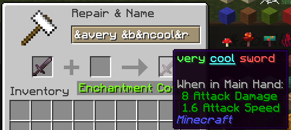
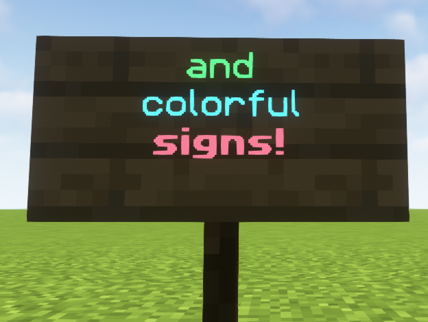

# ItemSignFormat

[Download](https://github.com/sexnine/ItemSignFormat/releases/download/1.0/ItemSignFormat-1.0.jar)

A simple Minecraft plugin that allows players to use formatting/colors in item names (on anvil) and on signs!

Supports Spigot/Paper on 1.19.

## Permissions

Note: All permissions are applied to OPs.

- `itemsignformat.sign.color` Allows using colors on signs.
- `itemsignformat.sign.formatting` Allows using formatting on signs.
- `itemsignformat.anvil.color` Allows using colors when naming items on anvils.
- `itemsignformat.anvil.formatting` Allows using formatting when naming items on anvils.

## Commands

Absolutely none.

## Images

